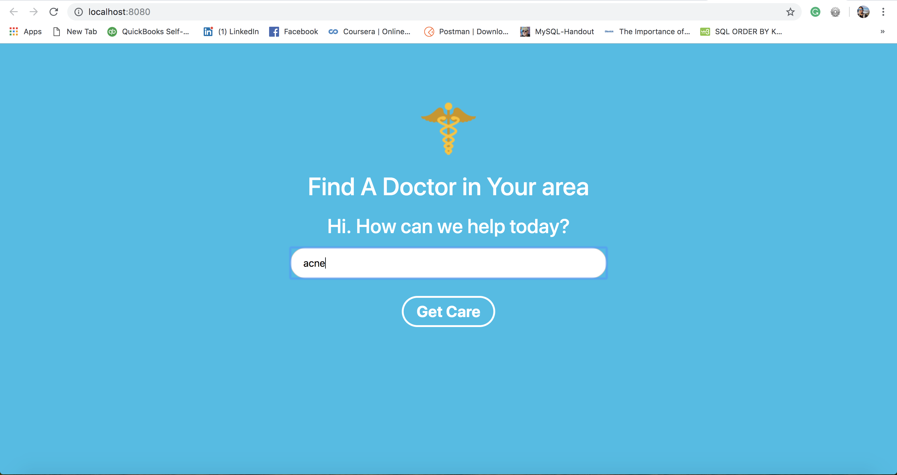
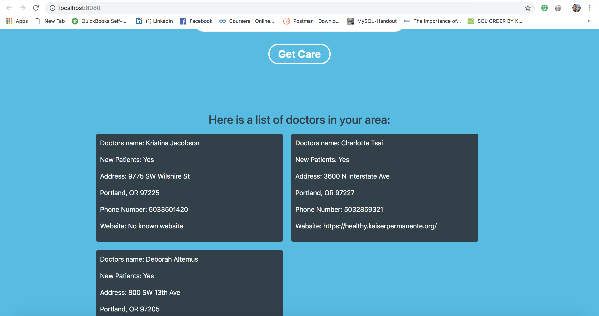

#  Doctor Lookup

_Published_  2/22/2019  
_Author_ **Gary Bermudez**

### Description
* This application will allow an user to search for doctors in the area(Portland,OR) by zip code, issue type (condition. ie."acne"), or doctor's name. The search will populate 10 doctors in the Portland OR area realted to the user's search criteria.

### Setup/Installation Requirements

###Cloning the Github repository (Mac OSX):
* Open the Terminal in your computer
* Make sure you're in your Desktop directory
* Clone the repository https://github.com/garybm/doctor-lookup
* In your Terminal, navigate to the project doctor-lookup
* Run `npm install` in the terminal to install dependencies
* Tun `npm run start` in the terminal to build and start the dev server
* The application will open your Chrome Browser (make sure you have downloaded Chrome browser).
* This application will need an API key to work. Go to the directory of the application and add (touch) an .env file. If you  don't already have an API key visit https://developer.betterdoctor.com/ to request one
* Navigate to the .env file and add `exports.apiKey = [API KEY HERE]`
* Once you have the API key in the .env file reload the project i.e. `npm run start`
* The application will function now that a key is connected
* Enter a search term, ie. doctor's name, zipcode or condition into the search field
* Click the Get Doctor CTA
* Note that the results will display (doctors in your area)

### Development Specs

* Be sure to reload the page after a search

| Behavior | Input | Output |
|----------|-------|--------|
* Enter a search criteria in to the form field | User inputs "acne" clicks Search condition | The application pulls results from the API related to the criteria.

* Here are some screen captures of the application:
* User input: 
* Output: Results from the search. 

### Known Bugs
* The site needs to be refresh in order to make a new search.

### Technologies Used
* HTML
* CSS
* SASS
* JavaScript
* jQuery 3.3.1
* Bootstrap 4.1.3
* Custom Webpack

## Support and contact details

_Email garybm.17@gmail.com with any questions._

## License

This software is licensed under the MIT license.

Copyright (c) 2018 **Gary Bermudez**
